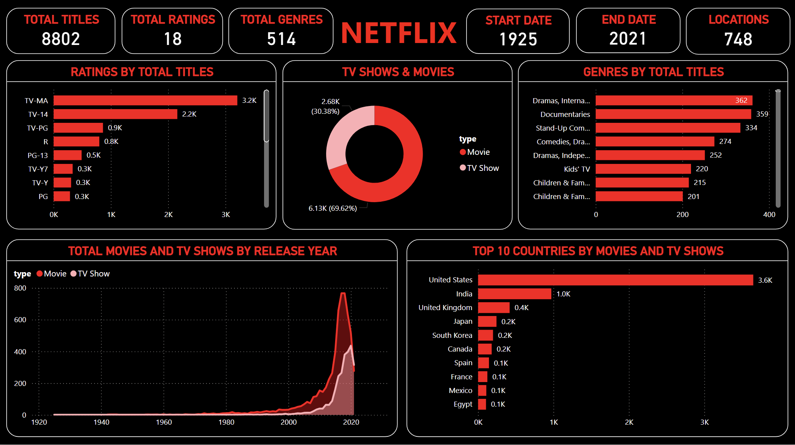

# Power BI Netflix Analysis

## Project Overview
This project analyzes Netflix content trends using Power BI.

## Tools Used
- Power BI
- Excel

## Key Insights
- Movies are more than TV shows
- United States produces the most content
- Content growth increased after 2015

## Dashboard Preview

## Author
Shahal P  
BCA Graduate | Learning Data Science
